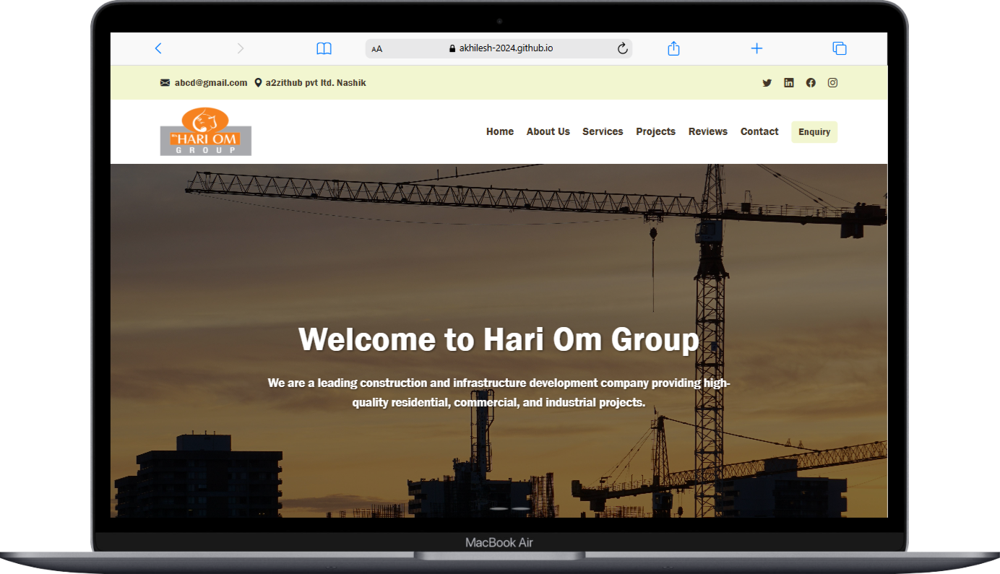

# 🏗️ Hari Om Construction – Responsive Single-Page Website



A modern, fully responsive portfolio website for Hari Om Construction, a leading construction company. Built for performance, accessibility, and a seamless user experience.

<div align="center">
  
  
  
  
</div>

## ✨ Key Features

- **Responsive Design**
  - Mobile-friendly, cross-device compatibility
  - Adaptive layouts for all screen sizes

- **Engaging Sections**
  - 🏠 Hero – Company branding and highlights
  - ℹ️ About – Company background and values
  - 🛠 Services – What we offer
  - 🏗 Projects – Portfolio grid of completed works
  - 💬 Testimonials – Client feedback
  - 📞 Contact – Easy communication form

- **Interactive Elements**
  - Sticky navigation bar with smooth scroll
  - Contact form with validation
  - Project showcase with images
  - Social media and contact links

## 🖥️ Demo

[Live Demo](https://akhilesh-2024.github.io/Hari-Om-Group)

## 🛠️ Technologies Used

| Technology      | Purpose                        |
|-----------------|--------------------------------|
| HTML5           | Semantic page structure        |
| CSS3            | Styling and animations         |
| JavaScript      | Interactive functionality      |
| Bootstrap 5     | Responsive framework           |
| Font Awesome    | Icons and visual elements      |
| Google Fonts    | Typography                     |

## 📂 Project Structure

```
Hari-Om-Group/
├── index.html
├── README.md
├── Styling/
│   └── main.css
├── Sources/
│   ├── [All website images, logos, project images]
```

## 🚀 Getting Started

1. **Clone the repository:**
   ```bash
   git clone https://github.com/yourusername/hari-om-group.git
   ```

2. **Open in your browser:**
   - Open `index.html` directly, or
   - Use a local server for best experience

## 🌟 Special Features

- **Performance Optimized**
  - Compressed images
  - Minified CSS/JS
  - Lazy loading for images

- **Accessibility**
  - ARIA labels
  - Keyboard navigation
  - Color contrast compliance

- **SEO Ready**
  - Semantic HTML
  - Meta tags
  - Structured data

## 📝 License

This project is licensed under the MIT License.

---

<div align="center">
  <sub>Developed with ❤️ for Hari Om Construction</sub>
</div>
